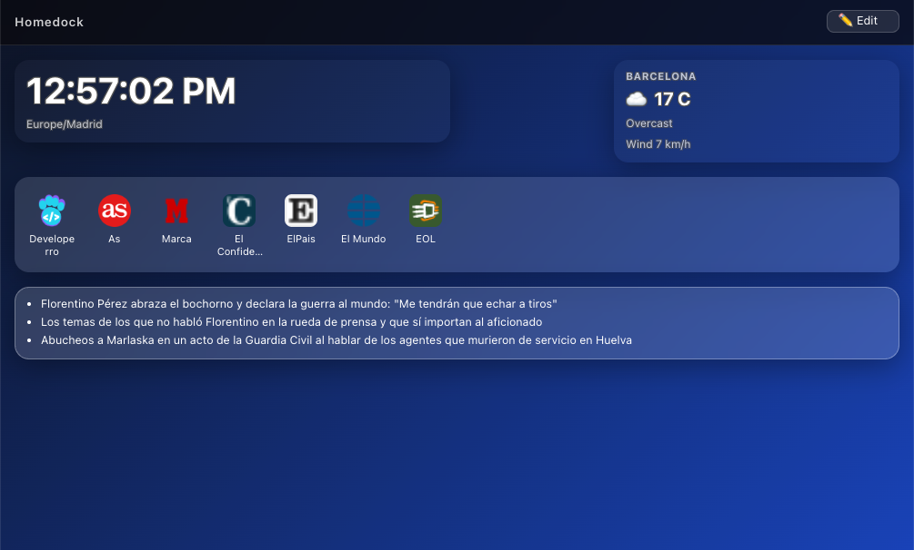
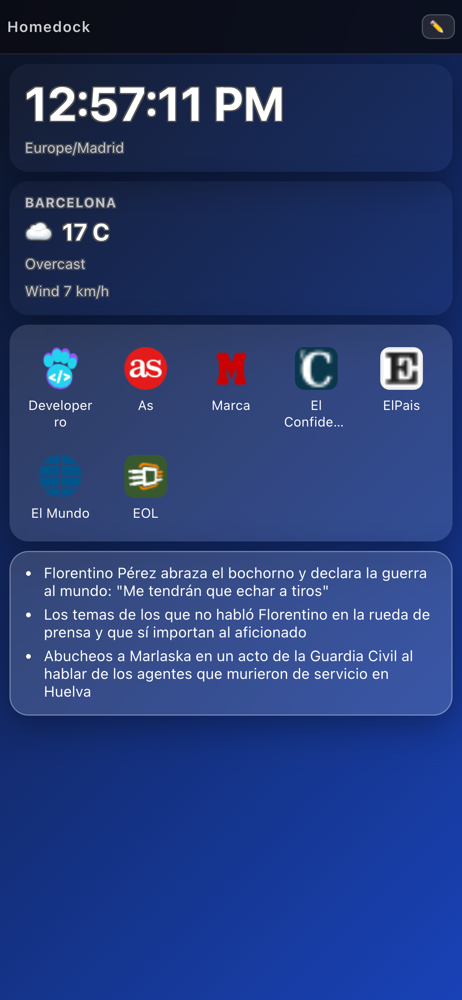
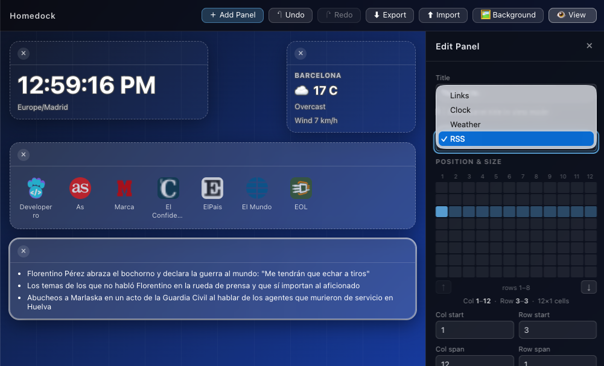
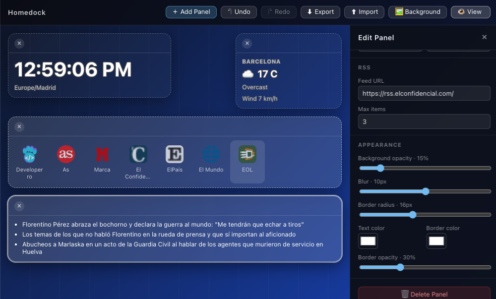
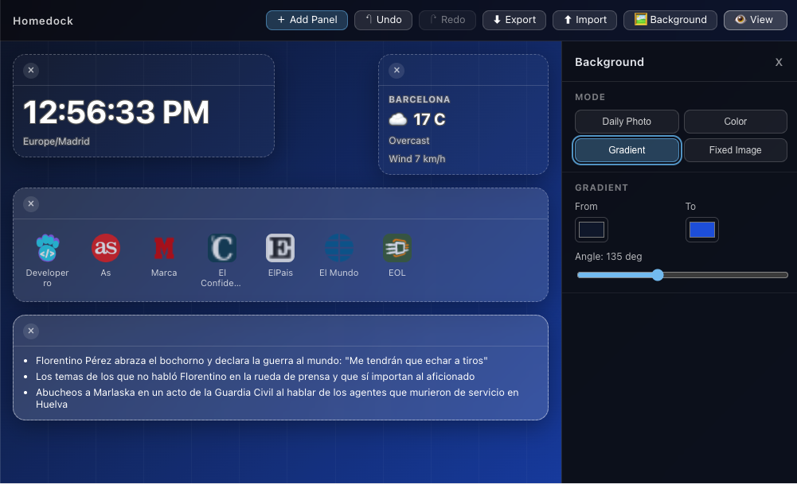
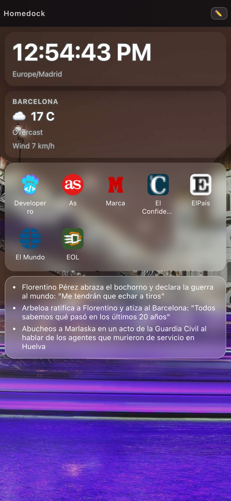

# Homedock

Homedock is a personal homepage dashboard available to everyone at https://homedock.page.

It helps you organize your daily web workflow in a single, customizable start page: quick links, clock, weather, RSS, and visual panels you can adapt to your own style. The product is designed to be fast, privacy-friendly, and practical for everyday use, with local-first persistence and portable JSON export/import.

Whether you use it as your browser home, a team kiosk view, or your own command center, Homedock gives you a clean interface with responsive editing tools, mobile-ready layouts, and multiple background modes to match your setup.

Desktop:



Mobile:



## Project status

Current status: active and functional for daily use.

Implemented:

- Grid-based panel system with collision-safe editing
- Undo/redo in edit mode
- View/Edit mode toggle with responsive toolbar behavior
- Import/export (JSON schema v1) with validation and collision checks
- LocalStorage persistence with migration support
- Configurable global background:
  - daily photo (deterministic per date)
  - solid color
  - gradient (colors + angle)
  - fixed uploaded image
- Widgets:
  - Links (list and uniform grid display with favicon preview)
  - Clock (digital/analog, timezone, optional timezone label, digital text size)
  - Weather (fixed coordinates or device geolocation, weather code icon + label, wind)
  - RSS feed reader
- Mobile UX improvements:
  - one-column panel layout
  - panel order matches desktop visual order
  - panel/background editor as bottom sheets

## Screenshots

Edit mode with panel editor open:



Configuring widget:



Background settings:




Homedock on desktop:


Homedock on mobile:




## Stack

- React 18
- TypeScript
- Vite 6
- Docker Compose (static container)

## Development

```bash
npm install
npm run dev
```

Default local URL: `http://localhost:5173`

## Build and preview

```bash
npm run build
npm run preview
```

## Docker

```bash
docker compose up --build
```

Or pull the published image directly from GHCR:

```bash
docker pull ghcr.io/fernandoescolar/homedock:latest
```

Default container URL: `http://localhost:8080`

## Usage

1. Open Homedock in view mode.
2. Switch to edit mode from the toolbar.
3. Add a panel, then click it to open the panel editor.
4. Configure widget type, layout, style, and data sources.
5. Optional: open Background settings (in edit mode) to choose photo/color/gradient/fixed image.
6. Export your configuration to JSON.
7. Import a previous JSON export when needed.

## Export schema (v1)

```json
{
  "schemaVersion": 1,
  "exportedAt": "2026-05-13T10:00:00.000Z",
  "background": {
    "mode": "daily",
    "solidColor": "#0f172a",
    "gradientFrom": "#0f172a",
    "gradientTo": "#1d4ed8",
    "gradientAngle": 135,
    "imageUrl": ""
  },
  "panels": [
    {
      "id": "uuid",
      "title": "Work",
      "showTitle": true,
      "col": 1,
      "row": 1,
      "colSpan": 4,
      "rowSpan": 3,
      "links": [
        {
          "id": "uuid",
          "label": "GitHub",
          "url": "https://github.com"
        }
      ],
      "style": {
        "bgOpacity": 0.15,
        "blur": 10,
        "borderRadius": 16,
        "textColor": "#ffffff",
        "borderColor": "#ffffff",
        "borderOpacity": 0.3
      },
      "linkDisplay": "grid",
      "widgetType": "weather",
      "widgetConfig": {
        "weather": {
          "city": "Madrid",
          "latitude": 40.4168,
          "longitude": -3.7038,
          "useGeolocation": false,
          "textColor": "#ffffff",
          "textBorderColor": "#000000"
        }
      }
    }
  ]
}
```
